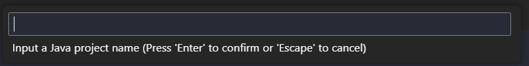

## Getting Started

Welcome to the VS Code Java world. Here is a guideline to help you get started to write Java code in Visual Studio Code.

## Folder Structure

The workspace contains two folders by default, where:

- `src`: the folder to maintain sources
- `lib`: the folder to maintain dependencies

Meanwhile, the compiled output files will be generated in the `bin` folder by default.

> If you want to customize the folder structure, open `.vscode/settings.json` and update the related settings there.

## Dependency Management

The `JAVA PROJECTS` view allows you to manage your dependencies. More details can be found [here](https://github.com/microsoft/vscode-java-dependency#manage-dependencies).

---

## How To Create New Project On VSCODE

### Persiapan Awal
1. **Install Java Development Kit (JDK)**
   - Pastikan kamu sudah menginstal **JDK** di komputer. Kamu bisa download JDK melalui tautan berikut:
     - [Download JDK](https://www.oracle.com/java/technologies/javase-downloads.html) atau [OpenJDK](https://openjdk.java.net/).
   - Pastikan Java sudah terpasang dengan menjalankan perintah berikut di terminal atau Command Prompt:
     ```bash
     java -version
     ```

2. **Install Visual Studio Code (VS Code)**
   - Download dan install **VS Code** melalui tautan berikut:
     - [Download VS Code](https://code.visualstudio.com/).

3. **Install Ekstensi Java di VS Code**
   - Buka VS Code, lalu buka **Extensions** (ikon kotak di sisi kiri atau tekan `Ctrl+Shift+X`).
   - Cari **"Java Extension Pack"** dan klik **Install**. Paket ini akan menginstal beberapa ekstensi yang diperlukan untuk pengembangan Java di VS Code:
     - Language Support for Java(TM) by Red Hat
     - Debugger for Java
     - Java Test Runner
     - Maven for Java
     - Visual Studio IntelliCode


## Create New Project
### Membuat Proyek Java Baru
1. **Buka VS Code**.
   
2. Tekan **`CTRL + SHIFT + P`** untuk membuka **Command Palette**. Akan muncul menu seperti gambar di bawah ini:

   

3. Ketik dan pilih **Java: Create Java Project...**.

4. **Pilih tipe proyek** yang ingin dibuat. Kamu akan diberi pilihan beberapa build tools seperti:
   - No build tools (Proyek tanpa build tools)
   - Maven
   - Gradle
   - Spring Boot
   - JavaFX, dan lain-lain.

   Pilih sesuai kebutuhanmu. Misalnya, pilih **No build tools** jika tidak memerlukan tools seperti Maven atau Gradle.

   

5. **Pilih folder** tempat kamu ingin menyimpan proyek. Kamu bisa memilih folder yang sudah ada atau membuat folder baru.

   

6. **Masukkan nama proyek** Java kamu. Setelah mengetik nama proyek, tekan `Enter` untuk konfirmasi.

   
